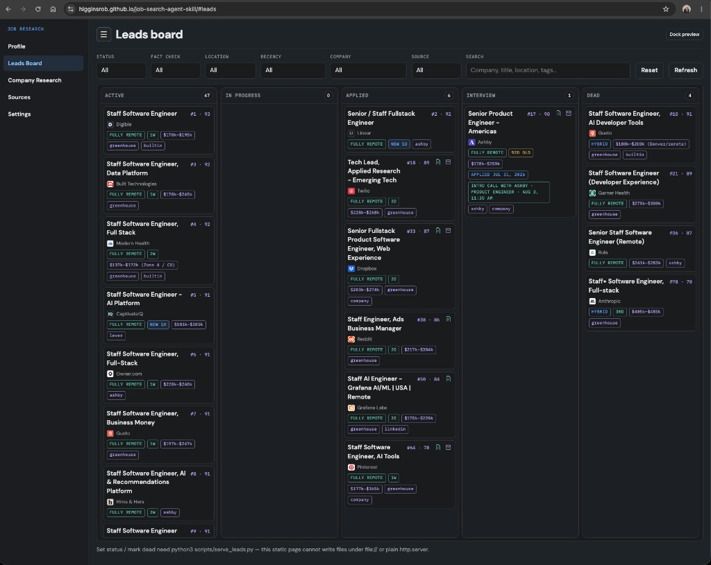

# Job Search Skills

Agent skills for a targeted job search: find and rank leads, research companies, and generate tailored resumes and cover letters. Includes a local HTML board for browsing and managing results.

**Live Example Leads Board:** [https://higginsrob.github.io/job-search-agent-skill/](https://higginsrob.github.io/job-search-agent-skill/)

[](https://higginsrob.github.io/job-search-agent-skill/)

Skills live in [`.cursor/skills/`](.cursor/skills/) (source of truth) and work out of the box in **Cursor**. Use `make skills` to install the same packages into other agents.

## Skills

| Skill | Command | What it does |
|-------|---------|--------------|
| Job search | `/job-search` | Search public boards (respects Sources toggles), fraud-check, rank up to 100 leads, save to the HTML board, write lead/company `speech.txt` |
| Sync resume | `/job-sync-resume` | Refresh `base-resume.md` + `candidate.md` from `./resume/`, and regenerate `resume.md` / `resume.html` / `resume.pdf` (preserves search prefs) |
| Generate resume | `/job-generate-resume <lead-folder>` | Tailor a one-page resume PDF into a lead folder (addresses `missing_gaps`) |
| Generate cover letter | `/job-generate-cover-letter <lead-folder>` | Write a short cover letter `.txt` into a lead folder (same gap rule) |
| Company detail | `/job-company-detail <company-path> [more]` | Create, refresh, or deepen a company brief under `companies/` |

## Quick start

1. Clone this repo and open it in Cursor (or another supported agent after installing skills).
2. Add your resume to [`resume/`](resume/README.md) (PDF and/or markdown).
3. Run `/job-search`. On first run the agent builds `candidate.md` and `base-resume.md` from your resume and asks about target roles, location, and stack preferences.
4. Browse the board:

```bash
make help      # list all make targets
make server    # http://127.0.0.1:8765
# or during UI work:
make dev       # auto-reloads on script/UI changes
```

5. After you edit the master resume, run `/job-sync-resume` so `base-resume.md` and `candidate.md` stay current (prefs are preserved).
6. For a saved lead, run `/job-generate-resume leads/<slug>/` and optionally `/job-generate-cover-letter leads/<slug>/`.
7. In **Company Research**, use **Update research** / **Go deeper** (or `/job-company-detail companies/<slug>/` / `… more`). Icons are fetched during that skill (or via `make icons`). Lead and company previews include **Speak** for `speech.txt` (play / back / forward / stop, with a persisted voice picker).
8. In **Sources**, enable or disable job boards; the board writes `leads/sources.json`, which `/job-search` respects.

To wipe local job history, company briefs, and candidate profile settings (keeps `resume/`):

```bash
make reset     # type RESET to confirm
```

## Install skills for other agents

`.cursor/skills/` is the source of truth. Synced project copies are gitignored; regenerate anytime with Make. Personal profile files (`candidate.md`, `base-resume.md`) are never copied.

### This repo (project-local)

Use when you open this repo in another agent:

```bash
make skills          # sync into all project agent folders
make skills-list     # show source skills + destinations
make skills-clean    # remove synced job-* skills from project agents
```

| Target | Destination | Agent |
|--------|-------------|-------|
| `make skills-claude` | `.claude/skills/` | Claude Code |
| `make skills-codex` | `.agents/skills/` | Codex / universal `.agents` |
| `make skills-opencode` | `.opencode/skills/` | OpenCode |
| `make skills-pi` | `.pi/skills/` | Pi |
| `make skills-qwen` | `.qwen/skills/` | Qwen |
| `make skills-gemini` | `.gemini/skills/` | Gemini CLI |

### Personal (~) installs

Use when you want these skills available outside this repo:

```bash
make skills-user            # all personal agent folders below
make skills-user-claude     # ~/.claude/skills/
make skills-user-codex      # ~/.agents/skills/
make skills-user-opencode   # ~/.config/opencode/skills/
make skills-user-pi         # ~/.pi/agent/skills/
make skills-user-qwen       # ~/.qwen/skills/
make skills-user-cursor     # ~/.cursor/skills/
```

After syncing, invoke the skills the same way (`/job-search`, etc.) in that agent. Keep editing under `.cursor/skills/` and re-run `make skills` (or `make skills-user`) when the packages change.

## Make commands

```bash
make help       # this list
make server     # serve the leads board (write APIs for status / applied / delete)
make dev        # same as server, auto-reload on scripts/, index.html, assets/
make icons      # fetch/refresh company icons under companies/*/icon.*
make reset      # wipe leads, companies, and candidate settings (keeps resume/)
make github-pages  # publish static demo (board + profile + resume)

# Project skill sync
make skills / skills-all / skills-list / skills-clean
make skills-claude | skills-codex | skills-opencode | skills-pi | skills-qwen | skills-gemini

# Personal skill sync
make skills-user
make skills-user-claude | skills-user-codex | skills-user-opencode
make skills-user-pi | skills-user-qwen | skills-user-cursor
```

Typical flow: `make server` → browse the board → `/job-search` to fill leads → `make skills` if you also use Claude/Codex/… → `make reset` to start over.

### Publish the static demo (`make github-pages`)

Resets the `gh-pages` branch to the latest `main`, force-adds your local (normally gitignored) demo data, commits, and force-pushes. That branch is the GitHub Pages source for the example:

[https://higginsrob.github.io/job-search-agent-skill/](https://higginsrob.github.io/job-search-agent-skill/)

Included on `gh-pages` only:

- `leads/` and `companies/`
- `resume/resume.md`, `resume/resume.html`, `resume/resume.pdf`
- `candidate.md` (copy of the profile for Pages) plus `.cursor/skills/.../candidate.md` and `base-resume.md`

```bash
make github-pages
```

Requires a clean tracked working tree and those profile/resume files to exist locally. This **publishes personal profile and resume material** publicly on the demo site — review before running.

## Layout

```
.cursor/skills/               # source of truth for skill packages
  job-search/                 # search, rank, fraud-check, persist leads
  job-sync-resume/            # resume → base-resume.md + candidate.md
  job-generate-resume/        # tailor resume → PDF
  job-generate-cover-letter/  # short cover letter
  job-company-detail/         # create / refresh / deepen company briefs
resume/                       # your resume (gitignored; add before searching)
leads/                        # saved job leads + sources.json (local; gitignored)
companies/                    # per-company briefs + icons (local; gitignored)
assets/ + index.html          # leads board UI
scripts/serve_leads.py        # local server with write APIs for the board
scripts/dev_server.py         # auto-reloading wrapper for UI work
Makefile                      # server, reset, icons, skill sync
```

## Privacy

These paths are gitignored so personal data is not committed by default:

- `resume/*` (except `resume/README.md`)
- `.cursor/skills/job-search/candidate.md` (see `candidate.example.md`)
- `.cursor/skills/job-generate-resume/base-resume.md` (see `base-resume.example.md`)
- `leads/*` (except `.gitkeep`, `index.example.json`, `sources.example.json`)
- `companies/*` (except `.gitkeep`)
- Synced agent skill trees (`.claude/skills/`, `.agents/skills/`, …) — regenerate with `make skills`

Keep personal materials out of public forks and PRs. On a **private** fork, you can remove the `leads/*` / `companies/*` ignore rules (or `git add -f`) if you want git to back up your research. The intentional exception is `make github-pages`, which publishes a demo snapshot of `leads/`, `companies/`, resume artifacts, and candidate profile to the `gh-pages` branch only.

## License

Add a license of your choice before publishing (none is bundled yet).
